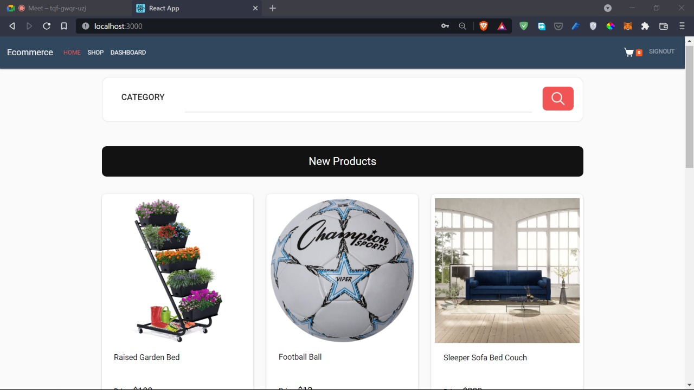
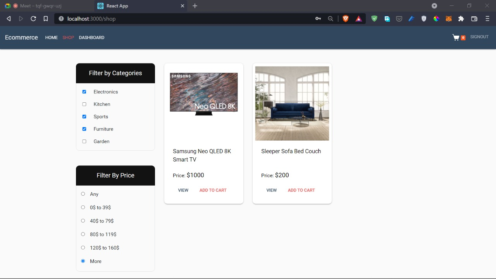
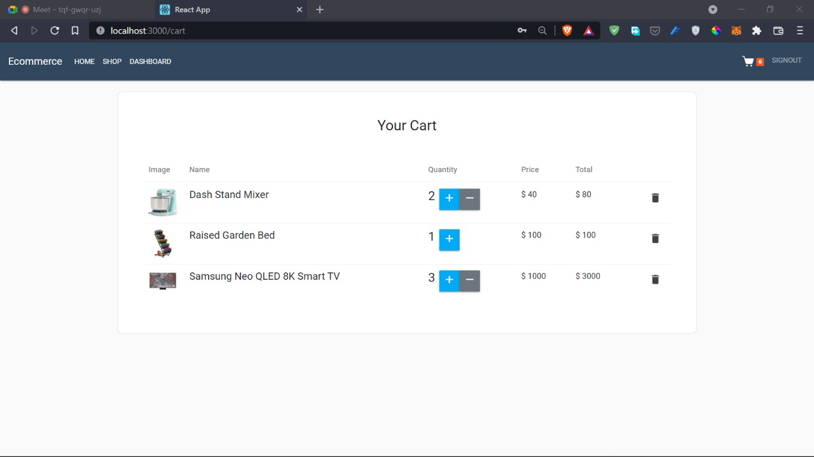

# ecommerce-MERN-
<h1>En utilisant:   MONGOODB - EXPRESS JS - REACT JS - NODE JS</h1>
<h3>les interfaces de l'application web  :</h3>
 
<h4><strong>sign-in interface :</strong></h4>
   

   
   

    
   
    
<h4><strong>sign-up interface  :</strong></h4>
   

   
   

    
   
 
<h4><strong>user interface :</strong></h4>
   

   
   

    
   
  
<h4><strong>home page:</strong></h4>
   

   
   

    
 
<h4><strong>shop page:</strong></h4>
   

   
   

    

 
<h4><strong>add products:</strong></h4>
   

   
   

    
   
    
<h4><strong>cart page:</strong></h4>
   

   
   

    
   
 
<h4><strong>admin interface:</strong></h4>
   

   
   

    
   
  
<h4><strong>create category interface:</strong></h4>
   

   
   

    
  
   
<h4><strong>add products:</strong></h4>
   

   
   

    
  
