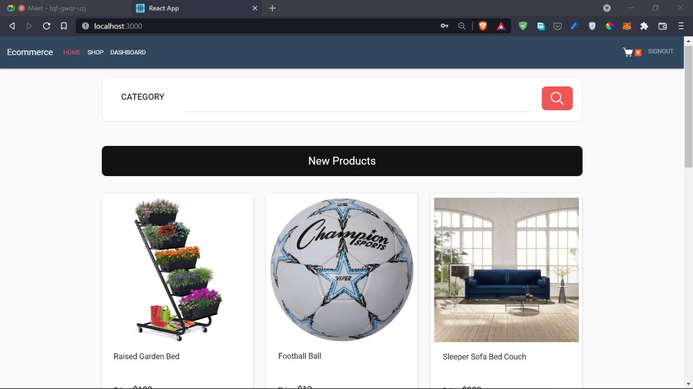
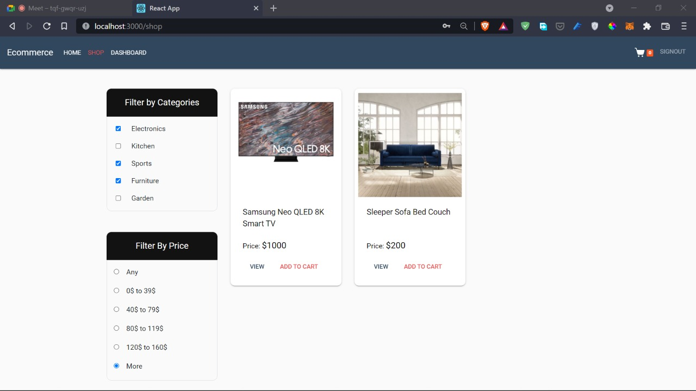
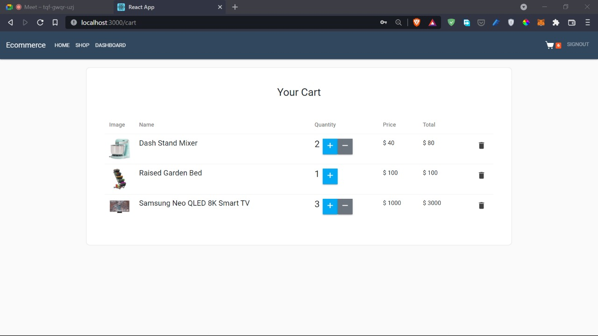
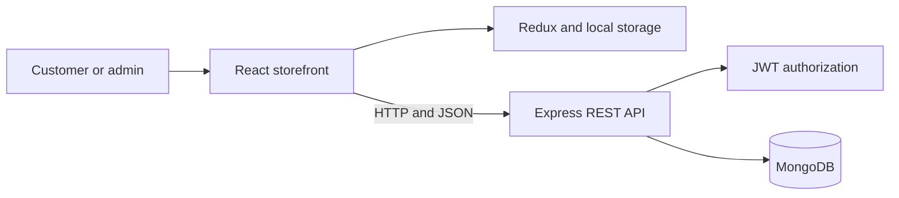
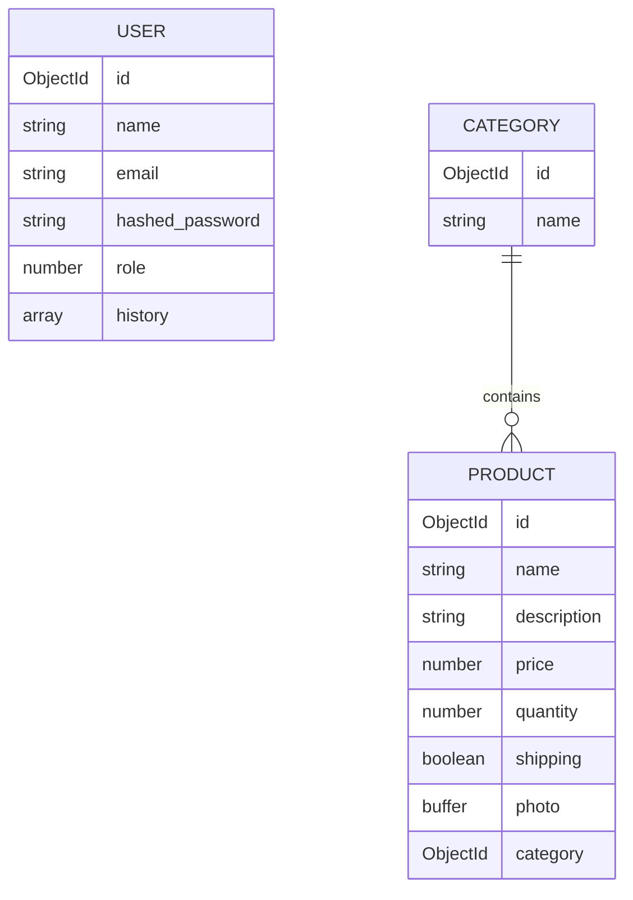

# MERN E-Commerce Platform

<p align="center">
  A full-stack e-commerce prototype built with MongoDB, Express, React, Redux, and Node.js.
</p>

<p align="center">
  
  
  
  
  
</p>

## Overview

MERN E-Commerce Platform is a learning-focused web application that demonstrates how a React storefront can communicate with a Node.js and Express REST API backed by MongoDB.

Customers can create an account, browse and search the catalogue, filter products, view related items, and manage a cart. Administrators receive protected interfaces for creating product categories and adding products with images.

> [!IMPORTANT]
> This repository is a portfolio prototype, not a production-ready commerce system. Checkout, payments, order processing, automated tests, and several security upgrades remain to be implemented.

## Screenshots

| Home | Shop |
| --- | --- |
|  |  |

| Product search | Shopping cart |
| --- | --- |
|  |  |

<details>
<summary><strong>View authentication and administration screens</strong></summary>

| Sign in | Sign up |
| --- | --- |
|  |  |

| User dashboard | Admin dashboard |
| --- | --- |
|  |  |

| Create category | Add product |
| --- | --- |
|  |  |

</details>

## Features

### Customer experience

- Account registration and JWT-based sign-in
- Protected customer dashboard
- Product catalogue with newest-product and best-seller sections
- Product search by name and category
- Filtering by category and price range
- Incremental catalogue loading
- Product details with related-product suggestions
- Stock availability indicators
- Redux-powered shopping cart
- Cart persistence in browser local storage
- Quantity adjustment, item removal, and line-total calculation

### Administration

- Role-based admin routes in the frontend and API
- Protected admin dashboard
- Category creation
- Product creation with category, price, quantity, shipping status, and image
- Image validation with a 1 MB upload limit
- API support for updating and deleting products and categories

## Architecture


```mermaid
flowchart LR
    U[Customer or admin] --> R[React storefront]
    R --> S[Redux and local storage]
    R -->|HTTP and JSON| A[Express REST API]
    A --> J[JWT authorization]
    A --> M[(MongoDB)]
```

The repository contains two independently managed applications:

- `ecom-FrontEnd` — React single-page application, routing, UI, Redux state, and API client
- `ecom_backend` — Express API, authentication middleware, controllers, and Mongoose models

## Technology stack

| Layer | Technology |
| --- | --- |
| Frontend | React 16, React Router 5, Redux, React Redux |
| Styling | Bootstrap, CSS Modules, custom CSS, Material Icons |
| Backend | Node.js, Express 4 |
| Database | MongoDB, Mongoose 5 |
| Authentication | JSON Web Tokens, Express JWT |
| Validation | Joi, Express Validator |
| File handling | Formidable |
| Utilities | Lodash, Moment.js, Toastr |

## Domain model


```mermaid
erDiagram
    USER {
        ObjectId id
        string name
        string email
        string hashed_password
        number role
        array history
    }
    CATEGORY {
        ObjectId id
        string name
    }
    PRODUCT {
        ObjectId id
        string name
        string description
        number price
        number quantity
        boolean shipping
        buffer photo
        ObjectId category
    }

    CATEGORY ||--o{ PRODUCT : contains
```

The cart is stored in the browser and is not persisted as an order in MongoDB.

## Repository structure

```text
MERN-ecommerce-platform/
├── captures/                  # Application screenshots
├── ecom-FrontEnd/
│   ├── public/
│   └── src/
│       ├── actions/           # Redux cart actions
│       ├── admin/             # Category and product forms
│       ├── auth/              # Route guards and auth helpers
│       ├── core/              # Storefront pages and components
│       ├── reducers/          # Redux reducers
│       ├── user/              # Auth and dashboard pages
│       ├── Routes.js
│       └── config.js
└── ecom_backend/
    ├── controllers/           # Request handlers
    ├── middlewares/           # Authentication and validation
    ├── models/                # Mongoose schemas
    ├── routes/                # REST endpoints
    └── index.js               # API and database bootstrap
```

## Getting started

### Prerequisites

- Node.js 14 LTS and npm
- MongoDB running locally, or a MongoDB Atlas connection string
- Git

The project uses dependencies from 2020. Node.js 14 is the most compatible choice for running the repository in its current form. Modernizing the dependency set is recommended before production use.

### 1. Clone the repository

```bash
git clone https://github.com/omar-sanad/MERN-ecommerce-platform.git
cd MERN-ecommerce-platform
```

### 2. Configure and start the API

```bash
cd ecom_backend
npm install
```

Create `ecom_backend/.env`:

```dotenv
DATABASE=mongodb://127.0.0.1:27017/mern_ecommerce
JWT_SECRET=replace-with-a-long-random-secret
PORT=8000
```

Start the API:

```bash
node index.js
```

The API will be available at `http://localhost:8000/api`.

### 3. Start the frontend

In a second terminal:

```bash
cd ecom-FrontEnd
npm install
npm start
```

The React application will open at `http://localhost:3000`.

The frontend currently reads the API address from `ecom-FrontEnd/src/config.js`:

```js
export const API_URL = "http://localhost:8000/api";
```

Update this value if the API runs on another host or port.

### 4. Create an administrator

New accounts receive the customer role (`role: 0`). For local development, register an account and then promote it in MongoDB:

```javascript
use mern_ecommerce
db.users.updateOne(
  { email: "admin@example.com" },
  { $set: { role: 1 } }
)
```

Sign in again after changing the role to access the admin dashboard.

## API overview

The API base URL is `http://localhost:8000/api`.

### Authentication and users

| Method | Endpoint | Access | Purpose |
| --- | --- | --- | --- |
| `POST` | `/signup` | Public | Create a customer account |
| `POST` | `/signin` | Public | Authenticate and receive a JWT |
| `GET` | `/signout` | Public | Clear the authentication cookie |
| `GET` | `/hello` | Authenticated | Verify a protected request |
| `GET` | `/user/:userId` | Account owner | Read a user profile |
| `PUT` | `/user/:userId` | Account owner | Update a user profile |

### Categories

| Method | Endpoint | Access | Purpose |
| --- | --- | --- | --- |
| `GET` | `/category` | Public | List all categories |
| `GET` | `/category/:categoryId` | Public | Read one category |
| `POST` | `/category/create/:userId` | Admin | Create a category |
| `PUT` | `/category/:categoryId/:userId` | Admin | Update a category |
| `DELETE` | `/category/:categoryId/:userId` | Admin | Delete a category |

### Products

| Method | Endpoint | Access | Purpose |
| --- | --- | --- | --- |
| `GET` | `/product` | Public | List, sort, and search products |
| `GET` | `/product/:productId` | Public | Read one product |
| `GET` | `/product/photo/:productId` | Public | Retrieve a product image |
| `GET` | `/product/related/:productId` | Public | List related products |
| `POST` | `/product/search` | Public | Filter and paginate products |
| `POST` | `/product/create/:userId` | Admin | Create a product |
| `PUT` | `/product/:productId/:userId` | Admin | Update a product |
| `DELETE` | `/product/:productId/:userId` | Admin | Delete a product |

Protected requests use the header:

```http
Authorization: Bearer <token>
```

## Engineering topics demonstrated

- Full-stack separation between a React client and REST API
- JWT authentication and role-based authorization
- CRUD operations with Express and Mongoose
- Relational references between MongoDB documents
- Multipart image upload and validation
- Search, sorting, filtering, and pagination
- Client-side state management with Redux
- Protected frontend routes for customers and administrators

## Author

Developed by [Omar Sanad](https://github.com/omar-sanad).
